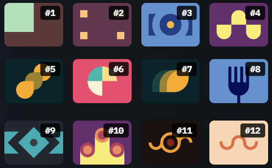

# CSS Battle

Let's design with code!

 Here is my submissions for the some problems on cssbattle.dev. These may not be the ways to solve these problem, but it still works. Some solutions might be skipped for some reason.

 ## Scoring

 I made this solutions for better understanding and readability, but still you can find some of the ways that I used to get high score(You can still score little by deleting extra spaces that I given in the solutions).

 Here are some [tips](https://cssbattle.dev/tips) I followed to get high score.

 ## Battle #1 - Pilot Battle

 

 - [#1 - Simple Square](./solutions/1-pilot-battle/1-simply-square.md)
 - [#2 - Carrom](./solutions/1-pilot-battle/2-carrom.md)
 - [#3 - Push Button](./solutions/1-pilot-battle/3-push-button.md)
 - [#4 - Ups n Downs](./solutions/1-pilot-battle/4-ups-n-downs.md)
 - [#5 - Acid Rain](./solutions/1-pilot-battle/5-acid-rain.md)
