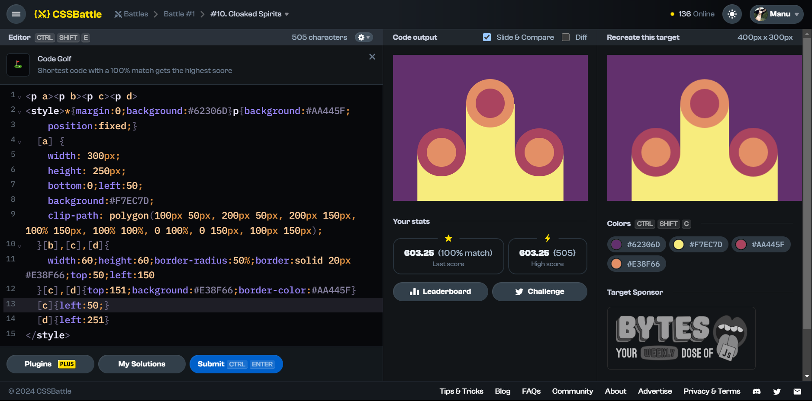

# Battle #1 - Pilot Battle

## #10 - Cloaked Spirits

[Link to the problem](https://cssbattle.dev/play/10)



```html
<p><p a><p b><p c><p d><!-- instead of using class(<p class="a"></p>) or id(<p id="a">) simply uses <p a></p> or <p> -->
<style>
    * {
        margin:0;
        background:#62306D;
    }
    p {
        background:#AA445F;
        position:fixed;
    }/*instead of using .a(for class) or #a(for id) can be called p[a] with p tag or just [a] with square brackets*/
   p[a] {
        width: 300px;
        height: 250px;
        bottom: 0;
        left: 50px;
        background:#F7EC7D;
        clip-path: polygon(100px 50px, 200px 50px, 200px 150px, 100% 150px, 100% 100%, 0 100%, 0 150px, 100px 150px);
    }
  p[b],p[c],p[d] {
        width:60px;
        height:60px;
        border-radius:50%;
        border:solid 20px #E38F66;
        top:50px;
        left:150px;
    }
  p[c],p[d] {
        top:151px;
        background:#E38F66;border-color:#AA445F;
    }
  p[c] {
        left:50px;
    }
  p[d] {
        left:251px
    }
</style>
```