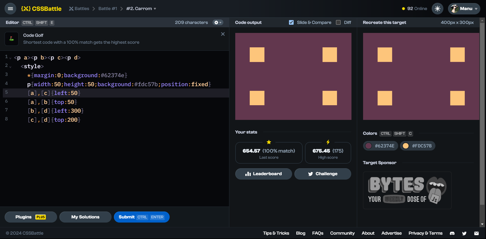

# Battle #1 - Pilot Battle

## #3 - Push Button

[Link to the problem](https://cssbattle.dev/play/3)



```html
<p c></p>
<p o></p>
<p i></p>
<style>
  body {
        margin:0;
        background:#6592CF;
        display:grid;
        place-items:center;
    }
  p {
        position:absolute;
    }
  p[c] {
        width:300px;
        height:150px;
        background:#243D83;
    }
  p[o],p[i]{
        border-radius:50%;
    }
  p[o] {
        width:150px;
        height:150px;
        border: 50px solid #6592CF;
    }
  p[i]{
        width:50px;
        height:50px;
        background:#EEB850;
    }
</style>