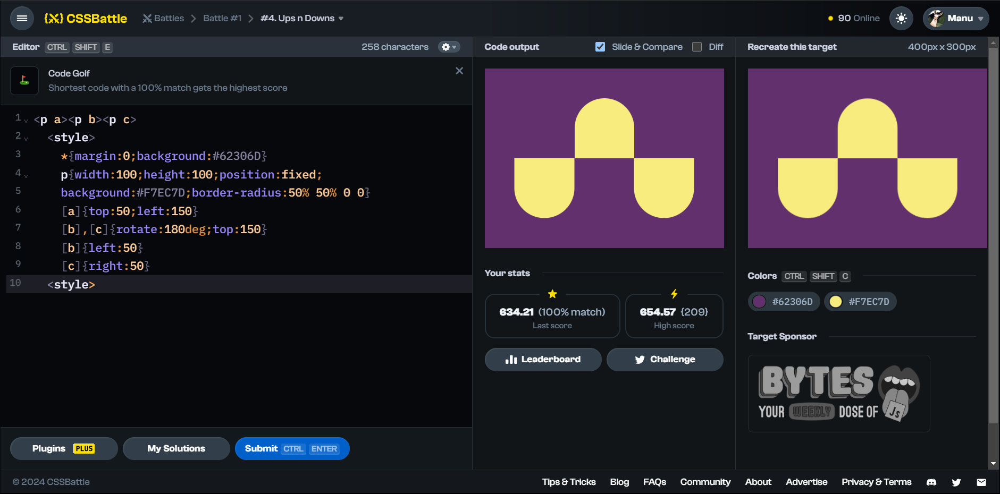

# Battle #1 - Pilot Battle

## #4 - Ups n Downs

[Link to the problem](https://cssbattle.dev/play/4)



```html
<p a></p><p b></p><p c></p><!-- instead of using class(<p class="a"></p>) or id(<p id="a">) simply uses <p a></p> or <p> -->
  <style>
    * {
        margin:0;
        background:#62306D;
    }
    p {
        width:100px;
        height:100px;
        position:fixed;
        background:#F7EC7D;border-radius:50% 50% 0 0;
    }
    p[a] {    /*instead of using .a(for class) or #a(for id) can be called p[a] with p tag or just [a] with square brackets*/
        top:50px;
        left:150px;
    }
    p[b],[c] {
        rotate:180deg;
        top:150px;
    }
    p[b] {
        left:50px;
    }
    p[c] {
        right:50px;
    }
  <style>
```