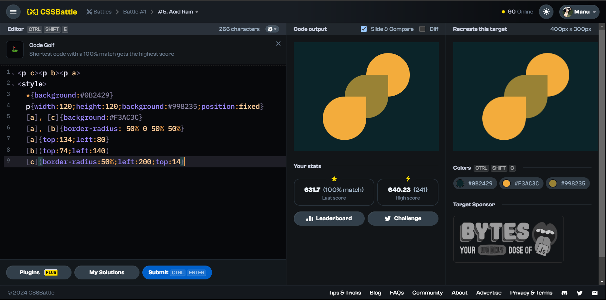

# Battle #1 - Pilot Battle

## #5 - Acid Rain

[Link to the problem](https://cssbattle.dev/play/5)



```html
<p c></p><p b></p><p a></p> <!-- instead of using class(<p class="a"></p>) or id(<p id="a">) simply uses <p a></p> or <p> -->
<style>
  * {
        background:#0B2429
    }
  p {
        width:120px;
        height:120px;
        background:#998235;
        position:fixed;
    }
  p[a], p[c] {   /*instead of using .a(for class) or #a(for id) can be called p[a] with p tag or just [a] with square brackets*/
        background:#F3AC3C;
    }
  p[a], p[b] {
        border-radius: 50% 0 50% 50%
    }
  p[a] {
        top:134px;
        left:80px;
    }
  p[b] {
        top:74px;
        left:140px;
    }
  p[c] {
        border-radius:50%;
        left:200px;
        top:14px;
    }
```