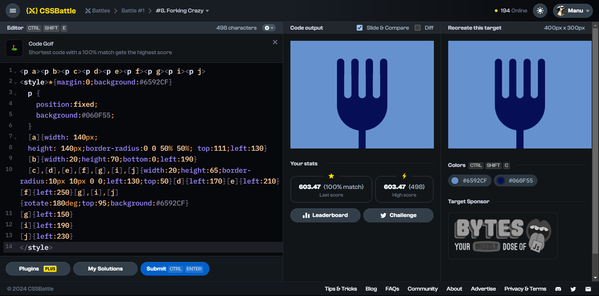

# Battle #1 - Pilot Battle

## #8 - Forking Crazy

[Link to the problem](https://cssbattle.dev/play/8)



```html
<p a></p><p b></p><p c></p><p d></p><p e></p><p f></p><p g></p><p i></p><p j></p><!-- instead of using class(<p class="a"></p>) or id(<p id="a">) simply uses <p a></p> or <p> -->
<style>
    * {
        margin:0;
        background:#6592CF;
    }
    p {
        position:fixed;
        background:#060F55;
    }/*instead of using .a(for class) or #a(for id) can be called p[a] with p tag or just [a] with square brackets*/
   p[a] {
        width: 140px;
        height: 140px;
        border-radius:0 0 50% 50%;
        top:111px;
        left:130px;
    }
   p[b] {
        width:20px;
        height:70px;
        bottom:0;
        left:190;
    }
    p[c],p[d],p[e],p[f],p[g],p[i],p[j] {   width:20px;
        height:65px;
        border-radius:10px 10px 0 0;
        left:130px;
        top:50px;
    }
  p[d] {
        left:170px;
    }
    p[e]{
        left:210px;
    }
    p[f]{
        left:250px;
    }
    p[g],p[i],p[j]{
        rotate:180deg;
        top:95px;
        background:#6592CF;
    }
    p[g]{
        left:150px;
    }
    p[i]{
        left:190px;
    }
    p[j]{
        left:230px;
    }
</style>
```