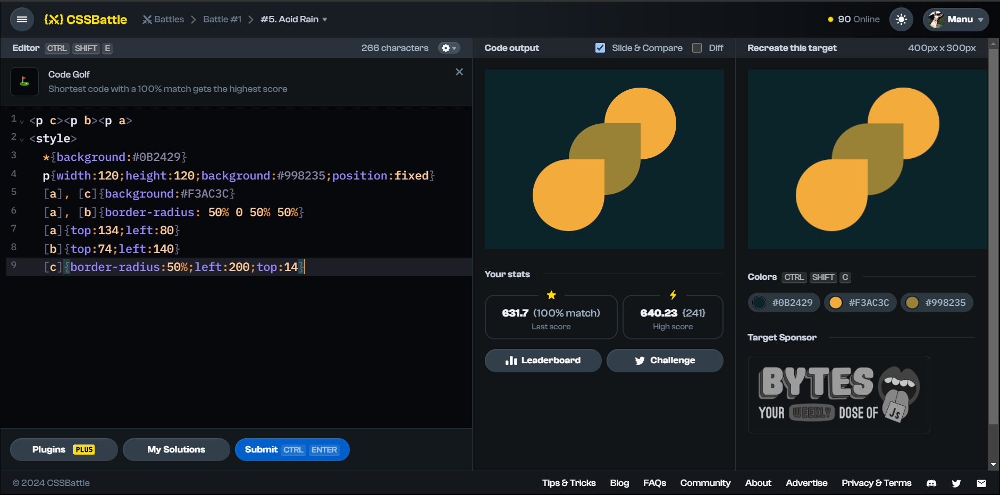

# Battle #1 - Pilot Battle

## #5 - Tesseract

[Link to the problem](https://cssbattle.dev/play/9)



```html
<p><p a><p b><p c><!-- instead of using class(<p class="a"></p>) or id(<p id="a">) simply uses <p a></p> or <p> -->
  <style>
    *{
        margin:0;
        background:#222730;
    }
    p{ 
        width:100%;
        height:150px;
        background:#4CAAB3;
        position:fixed;
        top:75px;
    }/*instead of using .a(for class) or #a(for id) can be called p[a] with p tag or just [a] with square brackets*/
    p[a]{
        width:250px;
        height:250px;
        background:#222730;
        rotate:45deg;
        left:75px;
        top:25px;
    }
    p[b]{
        width:150px;
        height:150px;
        left:125px;
        rotate:45deg;
        }
    p[c]{
        width:50px;
        height:50px;
        border-radius:50%;background:#393E46;
        left:175px;
        top:125px;
    }
```